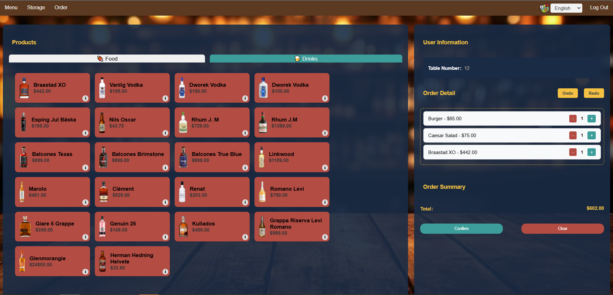

# Dutchman Smart Pub

## Group Members
- Kenneth Kuan Phing Ong
- Ngan Ha Pham
- Rongliang Zhang
- Vencel David Koczka
- Xiaoxi Zheng

## Project Overview
The Dutchman Smart Pub is a web application designed to modernize the pub experience with digital ordering, inventory management, and payment processing. This application provides both customer-facing features and staff management tools.

## Features
- **User Authentication**: Login system with different access levels
- **Multi-language Support**: Switch between different languages
- **Digital Menu**: Browse available beverages and place orders
- **Inventory Management**: Track and manage pub inventory
- **Order Management**: Process and track customer orders
- **Payment Processing**: "Handle" digital payments

## Technology Stack
- HTML5
- CSS3
- JavaScript (ES6+)
- jQuery
- MVC Architecture

## Project Structure
- `css/` - Stylesheets for the application
- `js/` - JavaScript files organized in MVC pattern
  - `controllers/` - Application controllers
  - `models/` - Data models
  - `views/` - UI rendering
  - `utils/` - Utility functions
- `data/` - Application data and resources
- `html/` - HTML templates
- `assets/` - Images, icons, and other static assets

## Getting Started
1. Clone the repository
2. Open `index.html` in a modern web browser
3. Log in with the provided credentials 
 (Note that regular customers are not able to log in, an employee must be logged in first then enter the table 
for regular customers)

## Development
This project follows the Model-View-Controller (MVC) pattern:
- Models handle data and business logic
- Views render the user interface
- Controllers connect models and views, handling user interactions

